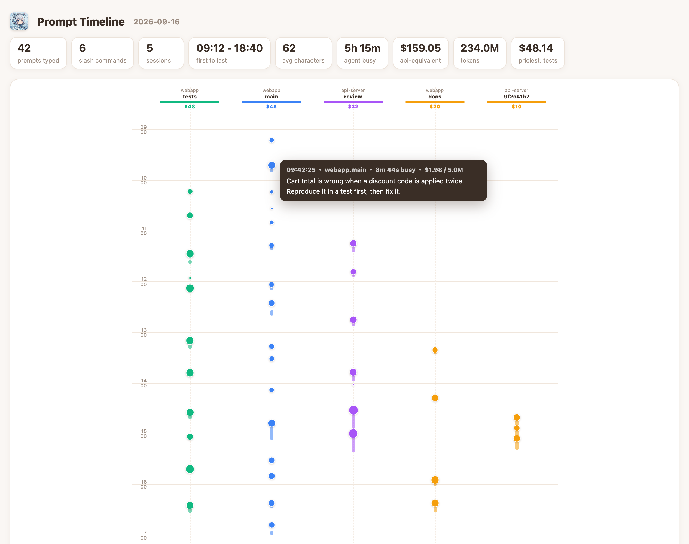
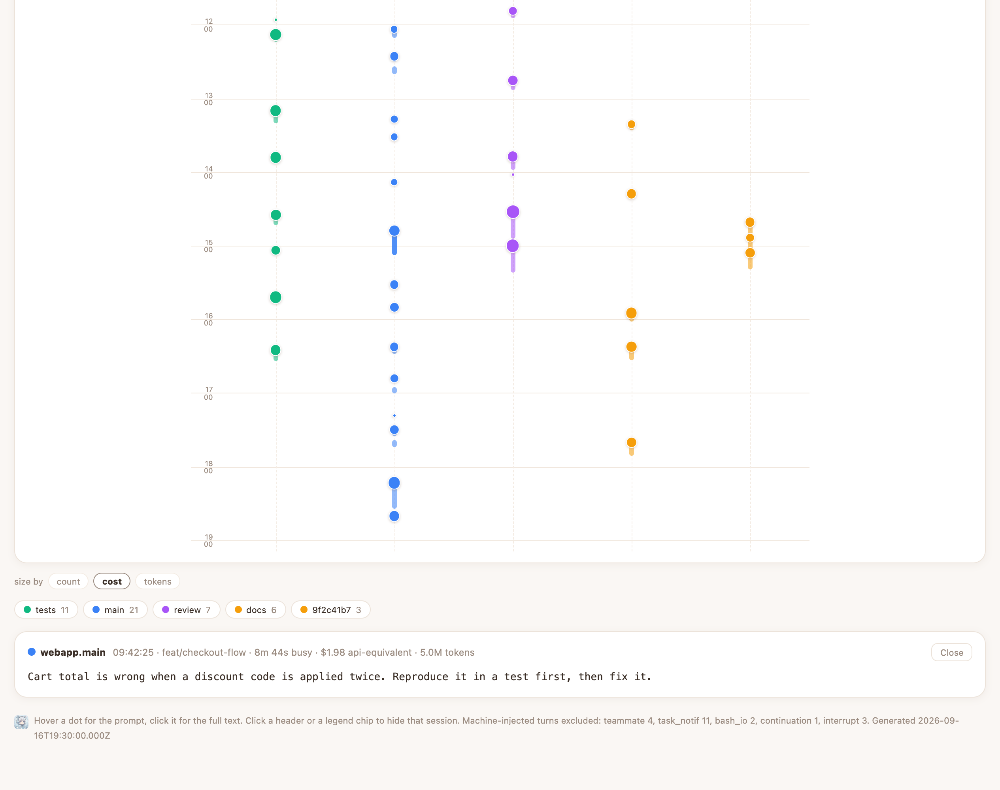

# prompt-timeline

See a day of your own Claude Code work as a timeline: **time runs down, sessions run across.**
One dot is one prompt you typed, and the line under it is how long the agent stayed busy
answering. Hover a dot to read the prompt, click it for the full text.

[日本語版 README](README.ja.md)



A column thick with line is a session that ran all day; a bare one is a session you only
poked. Clicking a dot opens the whole prompt underneath, with the branch and the time it took:



> Both screenshots are the real tool rendering [`sample/sample-day.json`](sample/sample-day.json),
> which is fabricated data — nobody's actual prompts.

## What it reads

Only `~/.claude/projects/<project>/<session>.jsonl` — the transcripts Claude Code already keeps
on your own machine. **No network call is made**, nothing is uploaded, and the HTML it produces
does not fetch anything at view time either.

## Quick start

Node 18 or newer. No dependencies to install.

```bash
git clone https://github.com/atsushiootani/prompt-timeline.git
cd prompt-timeline

node bin/prompt-timeline.mjs build          # today
open out/2026-09-16.html                    # xdg-open on Linux
```

`build` collects and renders in one step, and prints where it put both files:

```
saved: out/2026-09-16.json
saved: out/2026-09-16.html
open:  file:///…/out/2026-09-16.html
human=96 slash=1 sessions=16
```

Want a different day, or somewhere else to put it:

```bash
node bin/prompt-timeline.mjs build --date 2026-09-15 --out-dir ~/timelines
```

Try it without touching your own data:

```bash
npm run demo && open out/demo.html
```

## Use it from Claude Code

A skill ships in [`.claude/skills/prompt-timeline.build/`](.claude/skills/prompt-timeline.build/SKILL.md).
With this repository open, just ask:

> build a timeline of the prompts I typed today

It works out the date, runs the build, and tells you the counts and the path.
To use it from any repository, copy that skill directory into `~/.claude/skills/`
and point the commands inside it at wherever you cloned this.

## Commands

```
prompt-timeline build   [options]              collect + render (what you usually want)
prompt-timeline collect [options] --out FILE   transcripts -> JSON
prompt-timeline render  --in FILE [--out FILE] JSON -> a single HTML file
```

| Option | |
|---|---|
| `--date YYYY-MM-DD` | the day to look at (default: today) |
| `--out FILE` / `--out-dir DIR` | where to write (default: `out/`) |
| `--no-text` | drop the prompt bodies (session and branch names still remain) |
| `--drop-sdk` | also drop SDK / system-injected turns |
| `--projects-dir DIR` | where transcripts live (default: `~/.claude/projects`) |
| `--tz HOURS` | display against a fixed UTC offset instead of this machine's |
| `--busy-gap-cap MINUTES` | how long a silence can get before a busy span is cut (default: 30) |
| `--title TEXT` | page title |
| `--config FILE` | session names and colours (default: `config/agents.json` if present) |

## The busy lines

Next to each dot runs a coloured line: the stretch where the agent owed you an answer.
It opens at your prompt and closes when the assistant hands control back (`end_turn`).
The quiet while a tool runs is **inside** that line on purpose — a twenty-minute poll is
twenty minutes you were waiting, and the point of the line is to show that.

Work that starts again afterwards (a background task reporting in) draws a second line, so
the real idle in between is not painted over. A single silence longer than `--busy-gap-cap`
(30 minutes by default) ends the line where the transcript went quiet: past that, a long
job and a session abandoned mid-tool look identical, and guessing "busy" would draw bars
days long. The one thing the transcript cannot separate out is time spent waiting for you
to approve a tool — that reads as busy.

## Cost, and why it is not the token count

Columns are ordered by what they spent and labelled with it, so the priciest session is
the leftmost one. Dot area is that prompt's share. The `size by` buttons switch the whole
view between **cost** and **tokens** — or back to plain dots.

They are not the same ranking, which is the reason both are here. Cached input is billed
at a tenth of the input rate and output at five times it, so a token is not a token:
across one real day the effective rate ranged from $0.33 to $1.37 per million, and five of
ten sessions changed places depending on which you sorted by.

**The dollars are an API-equivalent, not a bill.** A Claude Code subscription is not billed
per token; the figure is what the same traffic would have cost on the API, which is useful
for comparing sessions and nothing else. Token counts are always shown beside it — prices
drift and new models appear, but the counts in the transcript stay true, so a stale price
table can be caught. A model with no price is counted in tokens and listed under
`unpriced_models` rather than quietly valued at zero.

> The 1-hour cache-write multiplier in `src/pricing.mjs` is **not yet verified** against
> published pricing. It moves a day's total by a few percent and does not reorder sessions.

## What counts as "a prompt you typed"

`type === "user"` records, minus everything the machine injected. Dropped: tool results,
`isMeta` turns, lines that are only a `<system-reminder>`, `<local-command-stdout>`,
agent-to-agent messages, task notifications, bash I/O, continuation summaries, interrupts,
and sub-agent turns. Slash commands are kept but counted separately (the diamonds).

The same conversation can appear in more than one transcript after a resume, so records are
de-duplicated on `(timestamp, first 80 characters)`. Typing the exact same thing in the same
second twice will therefore collapse into one dot.

**A day is cut on local time.** A record at 23:30 UTC belongs to the next day if you are at
+09:00, and the timeline files it there.

## How sessions get their names

Columns are labelled `<workspace>.<session>`. The name falls back in this order, so it works
on any machine without configuration:

1. `agentName` / `customTitle` recorded in the transcript by Claude Code
2. a `sessionLabel` rule from your config file
3. the first 8 characters of the session UUID

The workspace is the last directory of the transcript's `cwd`. If that reads long in a column
header, shorten it with `workspaceAlias`.

Configuration is optional — copy [`config/agents.example.json`](config/agents.example.json)
to `config/agents.json` only if you want your own names or colours. That file is gitignored.

## Using the view on its own

`view/timeline.js` and `view/timeline.css` have no dependencies and no build step. Drop them
into your own dashboard and call:

```js
PromptTimeline.mount(document.getElementById("timeline"), data);
```

`data` is exactly what the collector writes. Columns size themselves to the width they are
given, and the view follows `prefers-color-scheme` for dark mode.

## Layout

| | |
|---|---|
| `bin/prompt-timeline.mjs` | the CLI |
| `src/collect.mjs` | transcripts -> JSON |
| `src/render.mjs` | JSON -> one self-contained HTML file |
| `view/` | the timeline component (`timeline.js`, `timeline.css`, `template.html`) |
| `sample/sample-day.json` | fabricated data for the demo and the screenshots |
| `test/` | run with `npm test` |
| `.claude/skills/prompt-timeline.build/` | the Claude Code skill |

## Worth knowing

- **The generated HTML contains your prompts verbatim.** Check it before handing it to anyone,
  or rebuild with `--no-text`. `out/` and `*.html` are gitignored.
- `--no-text` drops only the bodies. Session names, workspace names and branch names stay —
  hide those with `workspaceAlias`, or strip them from the JSON yourself.

## License

The code is MIT — see [`LICENSE`](LICENSE).

### The mascot

`assets/concier-chan.png` is **not** covered by that MIT grant. It was generated with
Google Gemini and is used under Google's Terms of Service, which disclaim Google's
ownership of generated output. Because a purely AI-generated image may not be eligible
for copyright protection (see the U.S. Copyright Office, *Copyright and Artificial
Intelligence, Part 2: Copyrightability*, January 2025), no copyright is asserted in it.
To the extent any rights do exist, it is released under
[CC0 1.0](https://creativecommons.org/publicdomain/zero/1.0/) — take it and use it.

The file ships byte-for-byte as generated and may carry Google's invisible SynthID
watermark and C2PA content credentials. Please don't strip them.
